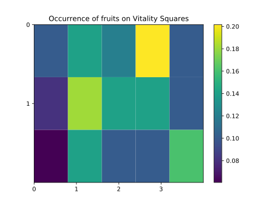

# About

Vitality Squares is a mini-game as part of the Vitality Wellness program. The 'game' is a type of probability puzzle, where there are 15 covered spots arranged on a 5 row by 3 column grid.
In each spot there is either a fruit, or a junk food -- the goal of the player is to guess the spots where a fruit is hidden. There are 6 fruits overall in each game.

# Goal

I've logged a year's worth of Vitality Squares minigames results (there is only one game per month) and I wanted to try to figure out if the game is really 'random'.

To do this, I took a screenshot of each game's results and then transcribed the coordinates of fruits. 

The coordinate system used is below:

|       |       |       |       |       |
|-------|-------|-------|-------|-------|
| (0,0) | (0,1) | (0,2) | (0,3) | (0,4) |
| (1,0) | (1,1) | (1,2) | (1,3) | (1,4) |
| (2,0) | (2,1) | (2,2) | (2,3) | (2,4) |

# Results

Using the 12 months of data available, this was the generated 2 dimensional histogram of locations where fruits are found.

# Future

Going forward, I'll update this chart with more data.

Ideally I would like to automatically detect the location of fruits using image processing rather than manually transcribing the location.
